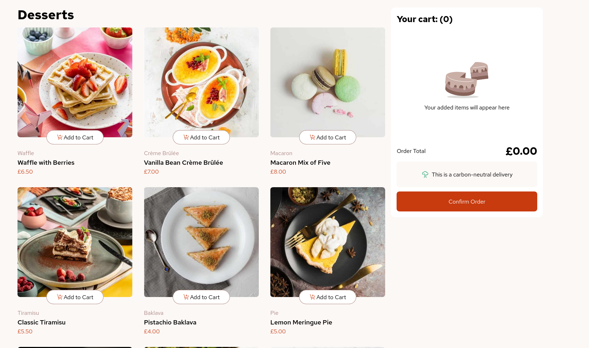

# Frontend Mentor - Product List with Cart

This is a solution to the [Product List with Cart](https://www.frontendmentor.io/challenges/product-list-with-cart-5MmqLVAp_d). Frontend Mentor challenges help you improve your coding skills by building realistic projects.

## Table of contents

- [Overview](#overview)
  - [The challenge](#the-challenge)
  - [Screenshot](#screenshot)
  - [Links](#links)
- [My process](#my-process)
  - [Built with](#built-with)
  - [What I learned](#what-i-learned)
  - [Continued development](#continued-development)
- [Author](#author)

## Overview

### The challenge

Your challenge is to build out this product list project that includes a functional cart and get it looking as close to the design as possible.

You can use any tools you like to help you complete the challenge. So, if you have something you'd like to practice, feel free to give it a go.

We provide the data for the products in a local `data.json` file. So you can use that to populate the UI dynamically if you choose.

Your users should be able to: 

- Add items to the cart and remove them
- Increase/decrease the number of items in the cart
- See an order confirmation modal when they click "Confirm Order"
- Reset their selections when they click "Start New Order"
- View the optimal layout for the interface depending on their device's screen size
- See hover and focus states for all interactive elements on the page

### Screenshot

### Links

- Solution URL: [Here](https://github.com/jambanix/frontendmentor_product_list_with_cart_react)
- Live Site URL: [Here](https://jambanix.github.io/frontendmentor_product_list_with_cart_react/)

## My process

### Built with

- ReactJS
- Tailwind CSS
- Vite

### What I learned

This was my first project in React and Tailwind. It has been a good experience overall and I have learned a lot from it:

- Using context
- How to build and deploy with Vite
- State management
- Structuring a project
- Using Classes
- Using Tailwind

### Continued development

I am following a couple of Udemy courses in JS/React - I will continue to do this while attempting projects to solidify learning

## Author

- Frontend Mentor - [@jambanix](https://www.frontendmentor.io/profile/jambanix)
